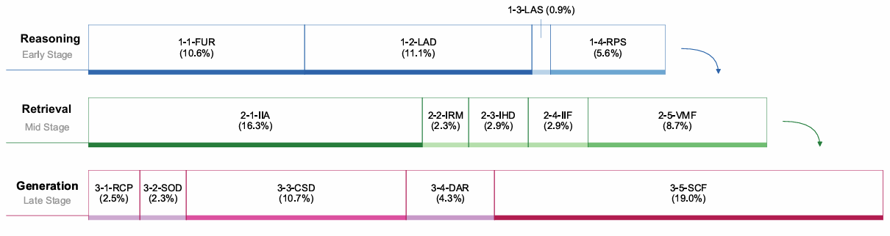
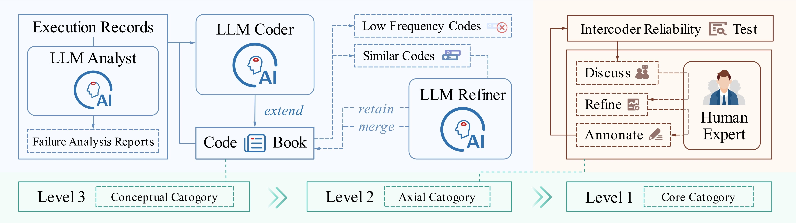

<div align="center">

<h2>How Far Are We from Genuinely Useful Deep Research Agents?</h2>

[English](README.md)

</div>

<div align="center">

  <a href='https://www.python.org/downloads/release/python-3119/'></a>
  <a href='LICENSE'></a>
  <a href='https://arxiv.org/abs/2512.01948'></a>
  <a href='https://huggingface.co/papers/2512.01948'></a>


</div>

<div align="center">
    
</div>

## News
- **[2025/01/11]** First upload of the DEFT toolkit to GitHub.

## Introduction
Deep Research Agents (DRAs) aim to automatically produce analyst-level reports, but current benchmarks often fail to capture the complexity of comprehensive report generation.

To address this, we present a unified framework for evaluating and diagnosing deep research agents:

1. **FINDER (Fine-grained DEepResearch bench)**: An enhanced benchmark consisting of **100 human-curated research tasks** with **419 structured checklist items** that standardize report structure, analytical depth, and factual grounding.
2. **DEFT (Deep rEsearch Failure Taxonomy)**: The first failure taxonomy for deep research agents, containing **14 fine-grained failure modes** across Reasoning, Retrieval, and Generation dimensions
3. **Checklist Pass Rate Evaluation** - Measures the percentage of checklist items passed by agent outputs
4.**Toolkit**: A complete set of tools for taxonomy generation and automated evaluation.

The toolkit supports both taxonomy generation (for creating failure categories) and model evaluation (for scoring agent performance).

<div align="center">
    
</div>

## Setup

### 1. Install Dependencies

Run the following command to install the required dependencies from the requirements.txt file:

```bash
pip install -r requirements.txt
```

### 2. Configure the APIs

Set up API credentials using environment variables or a `.env` file:

**Option A: Using .env file (Recommended)**

```bash
# Copy the example configuration
cp env.example .env

# Edit .env file and fill in your API credentials
nano .env
```

**Option B: Using environment variables**

```bash
export API_KEY="your_api_key"
export MODEL_NAME="gpt-4o"
export BASE_URL="https://api.openai.com/v1"
```

### 3. Prepare the Data

#### Records (`data/input/records.jsonl`)
A JSONL file containing records of the model performing deep research tasks, with each line a JSON object including at least `id`, `question`, and `article` fields.

#### Prompts (`prompt/*.txt`)
Plain-text templates for each pipeline stage.

#### Seeds (`prompt/seeds.md`)
A Markdown list of starter categories in `[level] Name: Description` format.

#### Final Taxonomy (`data/output/modes/final_DEFT.md`)
A Markdown list of Level 1 and Level 2 categories in the final taxonomy (DEFT) for evaluation.

## Form Categories in Taxonomy

The following steps demonstrate an example of forming the categories in DEFT.

### 1. Generate Failure Analyses

```bash
python -m deft_toolkit.analyses_generation \
  --model gpt-4o \
  --data data/input/records.jsonl \
  --out_file data/input/records_with_gpt_analysis.jsonl \
  --prompt_en_file prompt/analyses_generation_en.txt \
  --prompt_zh_file prompt/analyses_generation_zh.txt \
  --max_workers 15
```

This adds a `failure_analysis` field to each record.

### 2. Generate Categories (Modes)

```bash
python -m deft_toolkit.modes_generation \
  --model gpt-4o \
  --data data/input/records_with_gpt_analysis.jsonl \
  --prompt_file prompt/modes_generation.txt \
  --seed_file prompt/seeds.md \
  --out_file data/output/files/generation_gpt.jsonl \
  --mode_file data/output/modes/modes_gpt.md
```

Updates the `ModeTree` with occurrence counts and descriptions, saving LLM responses per report.

### 3. Refine Categories (Modes)

```bash
python -m deft_toolkit.refinement \
  --model gpt-4o \
  --prompt_file prompt/refinement.txt \
  --mode_file data/output/modes/modes_gpt.md \
  --out_file data/output/refinement.md \
  --merge_threshold 0.6 \
  --remove_threshold 0.01
```

This stage **merges** similar categories and **removes** low-frequency categories below the threshold.

## Evaluation Methods

This repository provides three evaluation approaches for deep research agents. Prepare your agent's inference results (as JSONL files) before running evaluations.

---

## Method 1: DEFT Taxonomy Evaluation

Evaluate your agent using the DEFT taxonomy with Taxonomy Positive Metric (S).

### Step 1: Prepare Agent Results

Place your agent's inference results in `data/input/records.jsonl`. Each line should be a JSON object with:

```json
{
  "id": "unique_identifier",
  "question": "research question",
  "article": "agent generated article"
}
```

### Step 2: Assign Failure Categories

```bash
python -m deft_toolkit.assignment \
  --model gpt-4o \
  --data data/input/records.jsonl \
  --out_file data/output/files/records_annotated.jsonl \
  --prompt_file prompt/assignment.txt \
  --mode_file data/output/modes/final_DEFT.md \
  --max_workers 15
```

### Step 3: Compute Taxonomy Positive Metric (S)

```bash
python -m deft_toolkit.metrics \
  --data data/output/files/records_annotated.jsonl \
  --mode_file data/output/modes/final_DEFT.md \
  --output_col responses
```

The metric score will be printed to console and saved in the output files.

---

## Method 2: FINDER Benchmark Evaluation

Evaluate your agent against the FINDER (Deep Research Benchmark) framework. Please refer to the `deep_research_bench` documentation for detailed evaluation instructions and requirements.

**Note:** We have made several modifications and improvements to the original deep_research_bench to optimize certain issues.


## Method 3: Checklist Pass Rate Evaluation

Measure the percentage of checklist criteria met by your agent's outputs.

### Step 1: Prepare Agent Results

Place your agent's inference results in `checklist_eval/data/`. The file should be in JSONL format with either:
- `article` field (for generated articles), or
- `prediction` field (for predictions)

Each line should include an `id` field matching the checklist data.

### Step 2: Configure Environment Variables

Set up the required API credentials for the evaluation model:

```bash
export API_KEY="your_api_key"
export MODEL_NAME="your_model_name"  # e.g., gpt-4o
export BASE_URL="your_api_base_url"
```

### Step 3: Run Checklist Evaluation

Basic usage with default settings:

```bash
cd checklist_eval
python llm_judge_v2.py
```

Or with custom parameters:

```bash
python llm_judge.py \
  --input_folder ./data \
  --output_folder ./my_results \
  --checklist_file ./data/checklist.jsonl \
  --max_concurrent_requests 20 \
  --request_timeout 180 \
  --max_retries 3
```

View help for all options:

```bash
python llm_judge.py --help
```

### Step 4: View Results

Evaluation results will be saved in `checklist_eval/evaluation_checklist_results/` with:
- Individual item pass/fail status
- Overall pass rate statistics
- Per-article evaluation details


## Data Format Specifications

### Agent Results Format

```json
{
  "id": "unique_identifier",
  "question": "research question text",
  "article": "agent generated article content"
}
```

### Checklist Format

```json
{
  "id": "unique_identifier",
  "topic": "research topic",
  "checklist": [
    {
      "title": "Criterion Name",
      "description": "Detailed description of what to check"
    }
  ]
}
```
## Acknowledgements

We would like to express our sincere gratitude to the following open-source projects for their valuable contributions to this research:

- **[DeepResearch Bench](https://github.com/Ayanami0730/deep_research_bench)**: A comprehensive benchmark for systematically evaluating Deep Research Agents. The evaluation framework and methodology provided by this project have been instrumental in guiding our research approach.

- **[TopicGPT](https://github.com/ArikReuter/TopicGPT)**: A GPT-based topic modeling tool. The innovative methods for topic extraction and analysis from this project have provided valuable technical support for our work.

## 🤝 Contributing

We welcome contributions! Please feel free to:

- Report bugs or issues
- Suggest new features or improvements
- Submit pull requests
- Improve documentation

## 📄 License

This project is licensed under the MIT License - see the [LICENSE](LICENSE) file for details.


## Citation

```bibtex
@misc{zhang2025fargenuinelyusefuldeep,
      title={How Far Are We from Genuinely Useful Deep Research Agents?}, 
      author={Dingling Zhang and He Zhu and Jincheng Ren and Kangqi Song and Xinran Zhou and Boyu Feng and Shudong Liu and Jiabin Luo and Weihao Xie and Zhaohui Wang and Tianrui Qin and King Zhu and Yuqing Wang and Qianben Chen and Yuchen Eleanor Jiang and Wei Wang and Jiaheng Liu and Wangchunshu Zhou},
      year={2025},
      eprint={2512.01948},
      archivePrefix={arXiv},
      primaryClass={cs.CL},
      url={https://arxiv.org/abs/2512.01948}, 
}
```

## 🌟 Misc

<div align="center">

[](https://github.com/OPPO-PersonalAI/FINDER_DEFT)

</div>
